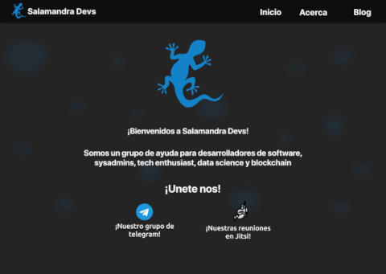

# Sitio web de Salamandra Devs

Este sitio es un desarrollo comunitario liderado desde Salamandra Devs con el apoyo de su comunidad de Telegram.

## Contribuir

Puedes ayudar a la construcción del sitio con tus contribuciones mientras vas aprendiendo. 

Solo tienes que hacer un fork de este repositorio para que lo tengas en tu cuenta de GitHub, luego lo clonas en tu equipo local, creas una nueva rama con un nombre alusivo al cambio que desees hacer, como por ejemplo _"cambio-color"_ o _"nuevo-boton"_ y te cambias a ella (`git checkout -b nuevo-boton`), realizas los cambios que desees y luego haces push a tu repositorio remoto (`git push origin nuevo-boton`). Esto te permitirá crear el `pull-request` en GitHub, con el que tu cambio será analizado por el equipo e incorporado a la página principal después de discutirlo contigo. 

También, debes ingresar al grupo de télegram [aquí](https://t.me/salamandradevs), allí te ayudaremos con el proceso para que finalmente te hagas parte del proyecto y aprendas junto con la comunidad. No es necesario que seas un desarrollador experiemtado, solo que tengas unos fundamentos mínimos de CSS y HTML, cualquier otra cosa es útil también, pero con esto bastará para que aprendas mucho.

### Nuestro Muckup
Gracias al compañero [Phosphorus](https://t.me/PhosphorusM) que nos ayudó con el muckup. Esto es el diseño base con el que debemos trabajar, no es obligatorio, pero si quieres hacer algo para llegar a esta meta adelante!!

- El Home

- El Blog

Si quieres comentarnos algo sobre el muckup, lo puedes hacer directamente en figma con este [enlace](https://www.figma.com/file/PmGd5FOrFBuaIYpJZWLJzJ/Salamandra-Devs?node-id=0%3A1&t=s0O5F1VyVbQZKxgw-0).

### Cómo correr el sitio

El sitio web está desarrollado en HTML, CSS y Javascript, todo vanilla, pero usando el compilador de sitios web estáticos **Hugo**. La versión 0.72 debería bastar, pero al día de hoy está disponible la versión 110. Intenta seguir estos pasos, no están completamente detallados porque varía de sistema a sistema pero en general es lo que sigue:

- Instala Hugo desde este [enlace](https://gohugo.io/installation/) para el sistema operativo que uses. En linux será muy fácil usando snap o cualquier otro gestor de paquetes. En Windows y Mac OSX puedes encontrar los binarios [aquí](https://github.com/gohugoio/hugo/releases/) o también puedes usar _Chocolatey_ que es un gestor de paquetes en Windows o _Homebrew_ en Mac OSX.
- Después de que hayas probado que Hugo esté instalado ejecutando `hugo version` _(si usas VSCode es posible que necesites cerrarlo y volverlo a abrir)_, sólo tienes que ir al directorio donde clonaste el sitio y ejecutar `hugo server`, con esto se levantará un servidor web en [http://localhost:1313](http://localhost:1313) y podrás ver el sitio funcionando. Asegúrate también de que estás dentro del directorio raíz del proyecto, en el cual encontrarás un directorio llamado `config\_default`, allí están las configuraciones del sitio.

## Licencia
El archivo de licencia lo puedes encontrar aquí mismo en el repositorio como [`LICENCE`](https://github.com/SalamandraDevs/salamandradevs/blob/main/LICENSE). Este repositorio está bajo la licencia GPL reducida versión 2.1, que te permite usar todo el código para tu proyecto siempre y cuando conserves la misma licencia; pero también puedes usar este código para tu proyecto de licencia cerrada, siempre y cuando el código se añada como biblioteca y no quede dentro de la porción cerrada de tu software.

## Red

Este sitio está publicado en la CDN de Netlify

